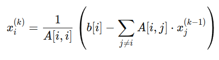

# РАСПРЕДЕЛЕНИЕ ВЫЧИСЛИТЕЛЬНОЙ ЗАДАЧИ В СИСТЕМАХ С ЦЕНТРАЛИЗОВАННЫМ УПРАВЛЕНИЕМ

Для вычисления большой СЛАУ.

## Метод вычисления

Метод Якоби — итеративный алгоритм, который хорошо подходит для параллельной обработки, поскольку обновление значений `x[i]` на каждой итерации не зависит от других `x[i]` в той же итерации.

## Метод распределения

1. Мастер нода получает в csv формате задание
2. Формируется начальное приближение [0, 0, ..., 0]
3. Отправляем на каждую воркер ноду матрица A и вектор b
4. Отправляем на каждую воркер ноду номер строки и текущий вектор X 
5. Воркер нода вычисляет новый Xi и возвращает его обратно мастеру
6. Ожидаем ответа от всех воркеров нод 
7. Обновляем вектор X на основе полученных значений Xi
8. Проверка сходимости по эпсилону

TODO
- Как писать типизированный REST API на TypeScript
- Как обрабатывать тело в uWebSockets.js